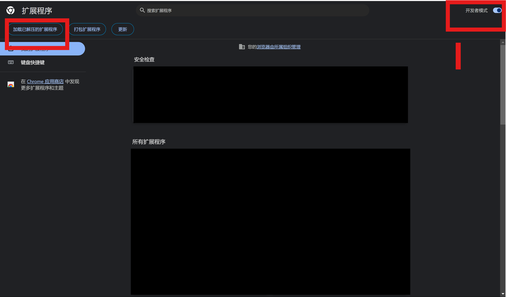
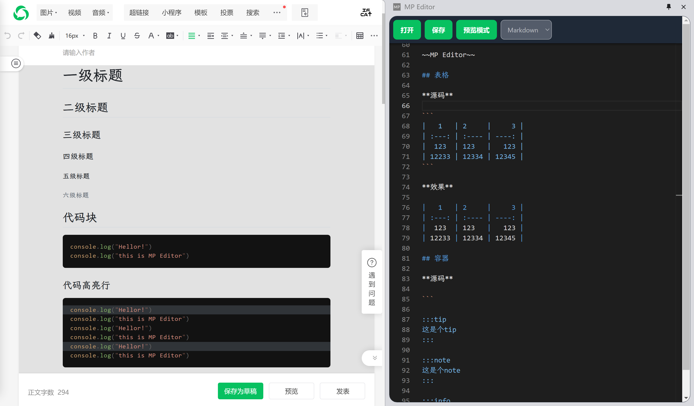
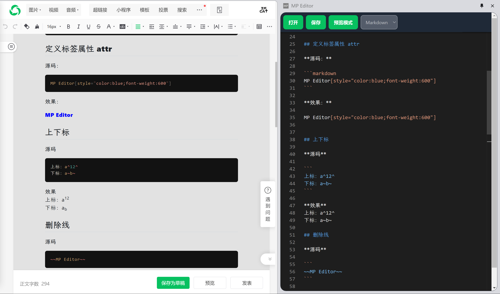
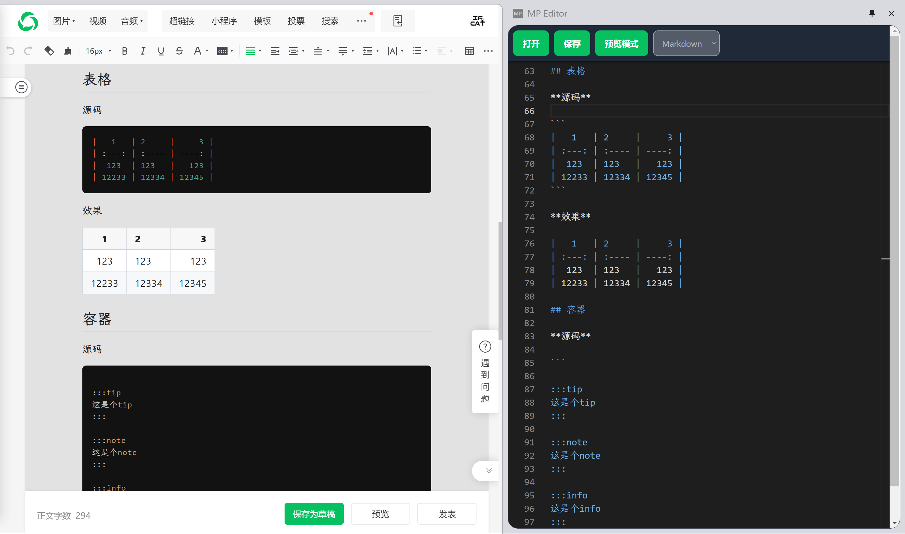
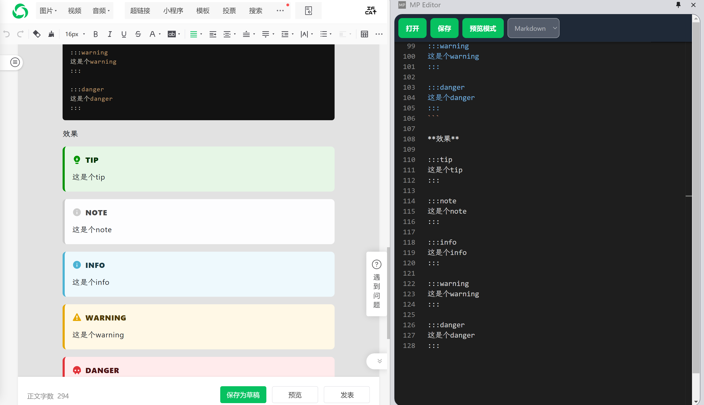
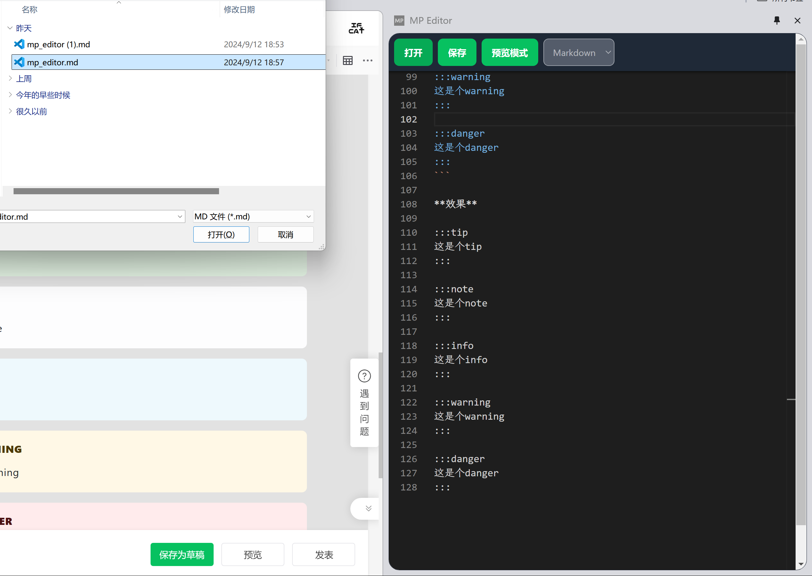
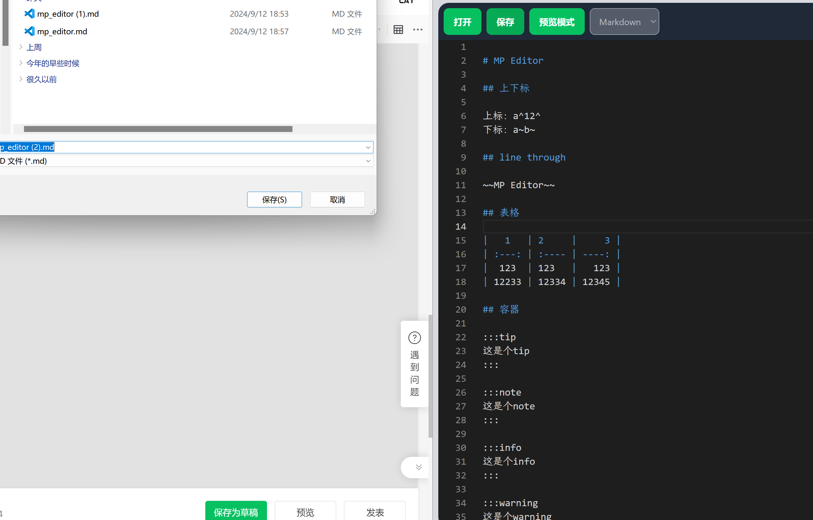
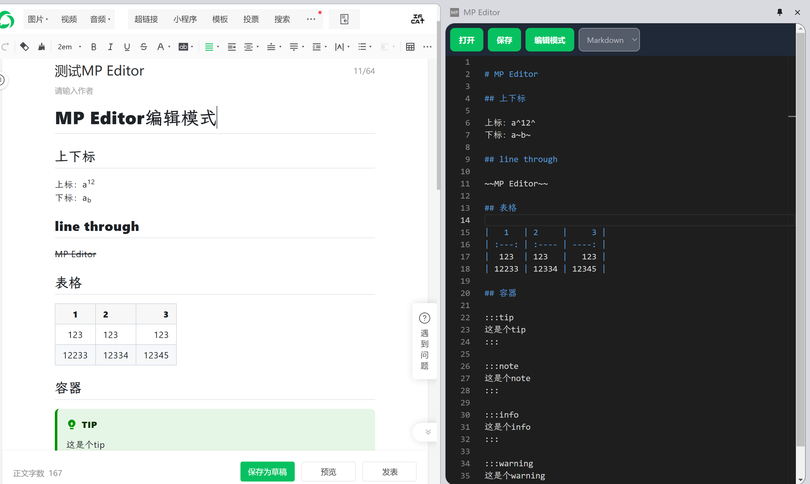
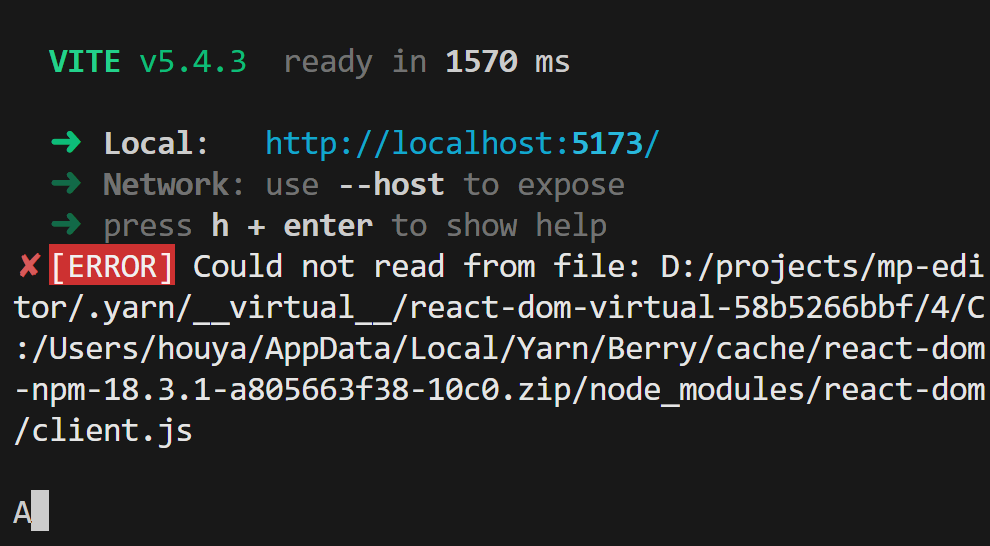

<h1 align="center">

<br/>
</h1>
<h4 align="center">用Markdown写公众号文章</h4>


## 源起

自己在编辑公众号文章的时候，感觉编辑文章的体验非常不友好。对于写技术文章来说，不追求花里胡哨的话，Markdown应该足够了。因此我希望能够在公众号文章编辑的时候，使用Markdown进行编辑，于是就有了这个项目。

## 实现

微信公众号编辑器是通过 `<body contenteditable="true"></body>` 实现的，因此只需向 `body` 中插入内容即可进行编辑。事实上，如果你愿意，你大可以直接在控制台向 `body` 中插入一段内容或是 `section` 包裹的复杂内容，依然可行。公众号页面子域是mp，这个插件也就叫MP Editor了哈哈哈哈哈。

实践中发现，官方会对使用的 **HTML 标签** 进行过滤，具体规则不太清楚。不过，经过测试，最终能够正常使用的是 `<section></section>` 标签，还有其他一些基本标签。因此，在 `Markdown` 转 `HTML` 时，只需将不支持的标签替换为 `section` 即可。

另外，样式使用也是一个问题。因为不可能使用样式类，只能使用行内的样式。因此，在 Markdown 转 HTML 时，需要将一个样式主题抽取为行内样式。当然，这也限制了一部分能力。还是那句话，不追求花里胡哨的话足够了，哈哈哈哈哈哈😂

## 使用（使用Microsoft Edge） 
1. 下载插件[mp-editor.zip](https://github.com/h-yw/mp-editor/releases)
2. 将插件解压后，在 `chrome://extensions/` 页面中，启用开发者模式，选择加载已解压的扩展程序，选择插件解压后的目录即可。


## 调试&构建

项目是在yarn ^2.x.x 下的pnp模式构建的，低版本yarn会报错。

### 调试

对于不依赖于chrome extension api的内容，直接作为页面访问调试就好了。
访问路径`localhost:5173/html/[pagename].html`

```bash
yarn dev
```

### 构建

构建结果会生成在 `dist` 目录下。直接在chrome浏览器中加载dist目录即可使用。

```bash
yarn install

yarn build
```


## 项目结构

项目是一个多页面的应用。

```
- /html: 自动生成html页面入口文件
- /src:
  - /src/entries: 页面相关，
    - /src/entries/[pagename].tsx: 页面入口文件，
    - /src/entries/[pagename]/[pagename].tsx: 页面内容，
  - /src/feature: 功能相关都在这里，
```


## 预览效果

<div>




</div>

* 打开文件



* 保存为文件
* 


* 编辑模式




##  一些过程问题

* yarn PnP模式报错



> 原因我也不知道，在 `yarnrc.yml` 配置文件中加入如下配置即可。

```yml:yarnrc.yml
enableGlobalCache: false 
```

* 找不到包类型报错

> 对于vscode来说，安装下面依赖即可。

```bash
yarn dlx @yarnpkg/sdks vscode
```

* vite + react+tailwind 样式不生效

> 在vite.config.ts中添加postcss插件tailwindcss

```ts:vite.config.ts
import { defineConfig } from "vite";
import react from "@vitejs/plugin-react";
import tailwindcss from "tailwindcss"; //添加

// https://vitejs.dev/config/
export default defineConfig({
  plugins: [react()],
  css: {
    postcss: {
      plugins: [tailwindcss()], // 添加
    },
  },
});
```

* **扩展开发过程中报错**
  
```
side-panel.html: Uncaught (in promise) Error: Could not establish connection. Receiving end does not exist.
```

> 刷新扩展后，页面在次刷新即可。


## 一些用到的

* [vite](https://vitejs.dev/)
* [react](https://reactjs.org/) 
* [tailwindcss](https://tailwindcss.com/)
* [markdown-it](https://github.com/markdown-it/markdown-it) 
* [shiki](https://github.com/shikijs/shiki)
* [monaco-editor](https://github.com/microsoft/monaco-editor)
* [github-markdown-css](https://github.com/sindresorhus/github-markdown-css)